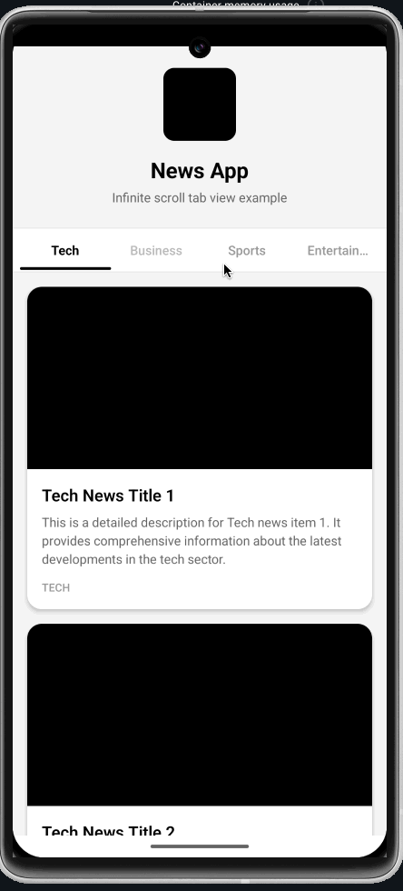

# react-native-infinite-material-tab

[](https://github.com/johntips/react-native-infinite-material-tab/actions/workflows/ci.yml)
[](https://www.npmjs.com/package/react-native-infinite-material-tab)
[](https://www.npmjs.com/package/react-native-infinite-material-tab)
[](./LICENSE)
[](https://www.typescriptlang.org/)
[](https://reactnative.dev/)
[](https://expo.dev/)

[](https://github.com/apps/renovate)
[](https://github.com/johntips/react-native-infinite-material-tab/network/updates)
[](https://coderabbit.ai)
[](https://maestro.mobile.dev)
[](https://github.com/johntips/react-native-infinite-material-tab/pulls)
[](https://github.com/johntips/react-native-infinite-material-tab/stargazers)

Infinite scroll tab view for React Native — built on **PagerView** + **Reanimated** for native-grade performance.

**New Architecture ready** | **Expo 55+ compatible** | **Drop-in replacement for react-native-collapsible-tab-view**

<p align="center">
  
  
</p>

## Architecture

```
┌─────────────────────────────────────────────────────┐
│  Tabs.Container                                     │
│                                                     │
│  ┌───────────────────────────────────────────────┐  │
│  │  Header (optional, collapsible)               │  │
│  └───────────────────────────────────────────────┘  │
│                                                     │
│  ┌───────────────────────────────────────────────┐  │
│  │  TabBar — ScrollView (smooth swipe)           │  │
│  │  ┌─────┬─────┬─────┬─────┬─────┐             │  │
│  │  │ Tab │ Tab │[Act]│ Tab │ Tab │  ← ∞ loop   │  │
│  │  └─────┴─────┴─────┴─────┴─────┘             │  │
│  │  ▓▓▓▓▓▓▓▓▓▓▓▓▓▓▓  ← Reanimated indicator    │  │
│  └───────────────────────────────────────────────┘  │
│                                                     │
│  ┌───────────────────────────────────────────────┐  │
│  │  PagerView (native gestures)                  │  │
│  │  ┌─────────┬─────────┬─────────┐             │  │
│  │  │  Page   │ [Visible│  Page   │             │  │
│  │  │ (lazy)  │  Page]  │ (lazy)  │             │  │
│  │  └─────────┴─────────┴─────────┘             │  │
│  │  offscreenPageLimit=1 → only 3 pages mounted  │  │
│  └───────────────────────────────────────────────┘  │
│                                                     │
└─────────────────────────────────────────────────────┘
```

### Lazy mount (`lazy={true}`) — pagerIndex-based (v0.2.0+)

With `infiniteScroll=true` the library generates `tabs.length × BUFFER_MULTIPLIER`
virtual pages so the user can swipe forever without hitting the edge. That means
**multiple virtual pages share the same realIndex** — pagerIndex 0, 5, 10, 15, …
all map to the same tab.

`lazy={true}` tracks mount state by **pagerIndex**, not realIndex:

```
realIndex:   [0][1][2][3][4][0][1][2][3][4][0][1][2][3][4] ...
              ↑                       ↑
          pagerIndex 0          pagerIndex 5 (same realIndex 0)
              │                       │
      User reaches here       User swipes here
              ↓                       ↓
          renders content       renders content independently
              │                       │
      pagerIndex 5, 10, 15…   pagerIndex 0, 10, 15…
      stay empty until visited  stay empty until visited
```

Only virtual pages the user **actually reaches** render their children. Non-visited
clones stay as empty `<View>` forever. This guarantees **at most one HeavyContent
mount per real tab**, even under heavy list rendering, complex hook composition,
or slow async data fetching inside the children.

> **v0.1.x had a critical bug here**: mount state was tracked by realIndex, so a
> single tab activation triggered up to `BUFFER_MULTIPLIER` (=10) parallel
> HeavyContent mounts, saturating the JS thread with 400–750ms dispatch latency.
> v0.2.0 fixes this; no API changes required.

## Why This Library?

### Rendering Efficiency — Only What You See

```
Traditional ScrollView approach (❌ wasteful):
┌───┬───┬───┬───┬───┬───┬───┬───┬───┬───┬───┬───┬───┬───┬───┐
│ 0 │ 1 │ 2 │ 3 │ 4 │ 5 │ 6 │ 7 │ 8 │ 9 │10 │11 │12 │13 │14 │
└───┴───┴───┴───┴───┴───┴───┴───┴───┴───┴───┴───┴───┴───┴───┘
  ▲   ▲   ▲   ▲   ▲   ▲   ▲   ▲   ▲   ▲   ▲   ▲   ▲   ▲   ▲
  ALL 15 pages mounted in DOM simultaneously
  Memory: O(N × VIRTUAL_MULTIPLIER)  →  45 pages for 5 tabs!


This library with PagerView (✅ efficient):
                    ┌───┬───┬───┐
                    │ 3 │[4]│ 5 │
                    └───┴───┴───┘
                      ▲   ▲   ▲
                      prev cur next
  Only 3 pages mounted at any time (offscreenPageLimit=1)
  Memory: O(3)  →  constant regardless of tab count!
```

### Infinite Loop — Clone & Jump Strategy

```
Page Layout (5 tabs):
┌──────────────────┬──────────────────┬──────────────────┐
│   Head Clones    │   Real Pages     │   Tail Clones    │
│  [0] [1] [2] [3] [4]│[0] [1] [2] [3] [4]│[0] [1] [2] [3] [4]│
└──────────────────┴──────────────────┴──────────────────┘
                    ↑ initialPage

Swipe left past clone[0]:             Swipe right past clone[4]:
  ┌──→ idle detected                    ┌──→ idle detected
  │    pendingJump = real[0]            │    pendingJump = real[4]
  │    setPageWithoutAnimation()        │    setPageWithoutAnimation()
  └──→ seamless! user sees no jump     └──→ seamless! user sees no jump

  No setTimeout ✓  No flicker ✓  Native-speed ✓
```

### Thread Architecture — Async Follow Design

```
┌─────────────────────────┐    ┌─────────────────────────┐
│      UI Thread          │    │      JS Thread          │
│  (native, 60fps)        │    │  (React, after idle)    │
│                         │    │                         │
│  PagerView gestures     │    │  onPageSelected         │
│  Page transitions       │    │    → setActiveIndex     │
│  Reanimated indicator ◄─┼────┼──── withTiming          │
│  ScrollView tab swipe   │    │  Tab centering (scrollTo)│
│                         │    │  onTabChange (deferred) │
└─────────────────────────┘    └─────────────────────────┘

  Swipe gesture    → Native thread (PagerView, 60fps, zero JS)
  Tab bar scroll   → Native thread (ScrollView, 60fps)
  Indicator move   → UI thread (withTiming, after swipe completes)
  Tab centering    → JS thread (scrollTo, after swipe completes)
  onTabChange      → JS thread (deferred to idle)

  Key: swipe and tab don't wait for each other.
  The initiator runs at 60fps, the follower catches up afterward.
```

### Tab Bar — Smooth Swipe with Virtual Loop

```
Tab Bar (ScrollView, ×3 virtual multiplier):
┌─────────────────────────────────────────────────────────────────┐
│  Set 1 (clone)     │  Set 2 (center)    │  Set 3 (clone)       │
│ [A][B][C][D][E]    │ [A][B][C][D][E]    │ [A][B][C][D][E]      │
└─────────────────────────────────────────────────────────────────┘
                      ↑ initial scroll position

  User swipes tab bar freely ← →
  Edge detected? → requestAnimationFrame → reset to center
  No setTimeout ✓  No jank ✓  Smooth momentum ✓

Tab indicator animation:
  ┌─────┬─────┬─────┬─────┬─────┐
  │  A  │  B  │ [C] │  D  │  E  │   activeIndex: 2
  └─────┴─────┴─────┴─────┴─────┘
              ▓▓▓▓▓                  ← Animated.View
                                       useSharedValue(x, width)
  Tab press C → D:                      withTiming(200ms)
  ┌─────┬─────┬─────┬─────┬─────┐
  │  A  │  B  │  C  │ [D] │  E  │
  └─────┴─────┴─────┴─────┴─────┘
                    ▓▓▓▓▓            ← slides smoothly
```

### Dynamic Tab Width

```
Fixed width (❌ old):
┌──────────┬──────────┬──────────┬──────────┬──────────┐
│  Tech    │ Business │   AI     │  Sports  │  Music   │
│  100px   │  100px   │  100px   │  100px   │  100px   │
└──────────┴──────────┴──────────┴──────────┴──────────┘
  Wastes space on short labels, truncates long ones

Dynamic width (✅ new):
┌──────┬──────────┬─────┬────────┬───────┐
│ Tech │ Business │ AI  │ Sports │ Music │
│ 56px │   88px   │40px │  72px  │ 64px  │
└──────┴──────────┴─────┴────────┴───────┘
  Each tab measured via onLayout → pixel-perfect centering
```

### Performance Comparison

```
                        This Library          ScrollView-based
                        ────────────          ────────────────
Page engine             PagerView (native)    ScrollView (JS)
Gesture tracking        UI thread             JS thread
Mounted pages           3 (constant)          N × multiplier
Tab indicator           Reanimated worklet    Conditional render
Edge reset              rAF + idle event      setTimeout(100ms)
Jump mechanism          setPageWithoutAnim    scrollTo + setTimeout
Tab item re-render      React.memo            Full re-render
Tab width               Dynamic (onLayout)    Fixed (100px)

                        ┌──────────────────────────────┐
Frame budget (16ms):    │                              │
                        │  ████░░░░░░░░░░░░  8ms  ✅  │  This library
                        │  ████████████████  16ms  ⚠️  │  ScrollView-based
                        │  ████████████████████ 22ms ❌│  (frame drop)
                        └──────────────────────────────┘
```

## Performance Best Practices for Consumer Apps

The library handles swipe gestures on the **native / UI thread** (see _Thread
Architecture_ above), but a few of its self-healing behaviors rely on
`onPageScrollStateChanged:idle` firing promptly after a swipe. If the JS
thread is busy at that moment — running periodic `refetchInterval`s across
every mounted tab, cascading re-renders, or first-mount layout for heavy
lists — the idle event can be delayed or skipped, and the native pager can
come to rest at a **fractional offset**: the indicator snaps to the new tab
but ~20-30% of a neighbouring page is still visible. The library's internal
forced-snap covers this case (v0.2.2+), but only when idle actually fires.

**The practical rule: keep the JS thread quiet during and immediately after a
swipe, even when your pages look heavy.** The patterns below are what made
the difference in production apps with dozens of tabs and heavy lists.

### 1. Stable subscription, focus-gated refetch cadence

With React Query (or any similar data layer), the naive pattern
`enabled: isFocused` causes the query subscription to tear down and
re-establish every time the user swipes away from a tab and back. Each
flip costs 50-100 ms of JS work. Better: **keep the subscription alive once
focused**, and gate only the **periodic** refetch by focus state.

```tsx
function ArticleTab({ category, isFocused }: Props) {
  // Once a tab has been focused even once, keep its subscription stable.
  // No more restart/refetch storms on rapid back-and-forth swipes.
  const stickyEnabledRef = useRef(false);
  if (isFocused) stickyEnabledRef.current = true;

  const { data } = useQuery({
    queryKey: ['articles', category],
    queryFn: () => fetchArticles(category),
    enabled: stickyEnabledRef.current,

    // 👇 gate *only* the periodic refetch by focus state.
    // Otherwise every mounted tab keeps firing the interval
    // concurrently, spiking JS thread load every few minutes.
    refetchInterval: isFocused ? 5 * 60 * 1000 : false,
    refetchIntervalInBackground: false,
    refetchOnWindowFocus: false,
  });

  return <List data={data} />;
}
```

Why this matters: with N tabs, the naive pattern fires **N parallel
intervals**. With the gated pattern, only the focused tab ticks — the same
request volume as the "enabled: isFocused" pattern, but without the
subscription restart cost during swipes.

### 2. Per-tab `isFocused` derived from the store, not from a parent state flip

If the tab-change callback flips a React state on a parent component, every
mounted tab re-renders, and each of their `isFocused` transitions fires a
cascade of effects. Derive `isFocused` **per tab, directly from the store**
so only two tabs re-render per change (the one you left and the one you
entered) — not all N.

```tsx
// ❌ Parent state flip → all N tabs re-render cascade
function Parent() {
  const [displayedTab, setDisplayedTab] = useState('home');
  return (
    <Tabs.Container onTabChange={(e) => setDisplayedTab(e.tabName)}>
      {tabs.map((t) => (
        <Tabs.Tab key={t.name} name={t.name} label={t.label}>
          <TabContent isFocused={displayedTab === t.name} />
        </Tabs.Tab>
      ))}
    </Tabs.Container>
  );
}

// ✅ Each tab subscribes to the store by name — only the old & new focused
//    tabs re-render on change.
function TabContent({ tabName }: { tabName: string }) {
  const isFocused = useTabStore((s) => s.activeTabName === tabName);
  // ...
}
```

### 3. Stable `Tabs.Container` props

Inline function props and inline style objects produce a new reference on
every parent render, which forces `Tabs.Container` to re-examine its
children. Move styles to module constants (or `StyleSheet.create`) and wrap
`renderHeader` / `renderTabBar` in `useCallback`.

```tsx
// ❌ New reference on every render
<Tabs.Container
  renderHeader={() => <Header />}
  renderTabBar={(p) => <MaterialTabBar {...p} indicatorStyle={{ height: 2 }} />}
  containerStyle={{ flex: 1 }}
/>

// ✅ Stable references
const CONTAINER_STYLE = { flex: 1 } as const;
const INDICATOR_STYLE = { height: 2 } as const;

function Screen() {
  const renderHeader = useCallback(() => <Header />, []);
  const renderTabBar = useCallback(
    (p: TabBarProps) => <MaterialTabBar {...p} indicatorStyle={INDICATOR_STYLE} />,
    [],
  );

  return (
    <Tabs.Container
      renderHeader={renderHeader}
      renderTabBar={renderTabBar}
      containerStyle={CONTAINER_STYLE}
    >
      {/* ... */}
    </Tabs.Container>
  );
}
```

### 4. Gate heavy child mount behind `InteractionManager`

The library promises 60fps **swipe** via the native pager — but a freshly
mounted heavy child (big list, many hooks, fresh data fetch) will block the
JS thread for hundreds of ms immediately after the swipe lands. Render a
cheap skeleton first, then mount the heavy content after
`InteractionManager.runAfterInteractions`. This defers the JS cost until the
pager has finished settling, so forced-snap runs on an uncontested thread.

```tsx
function ArticleTab({ category }: { category: string }) {
  const activeIndex = useActiveTabIndexValue();
  const tabs = useTabs();
  const isFocused = tabs[activeIndex]?.name === category;
  const [ready, setReady] = useState(false);

  useEffect(() => {
    if (!isFocused || ready) return;
    const handle = InteractionManager.runAfterInteractions(() => setReady(true));
    return () => handle.cancel();
  }, [isFocused, ready]);

  return ready ? <HeavyList category={category} /> : <Skeleton />;
}
```

### 5. Throttle per-swipe side effects (image reload, haptics etc.)

Callbacks like "reload images on tab return to work around native image
cache eviction" should **not** fire on every swipe — a quick back-and-forth
is not a genuine tab return. Guard them by the time the tab was
un-focused:

```tsx
const lastUnfocusedAtRef = useRef(Date.now());
const prevFocusedRef = useRef(isFocused);

useEffect(() => {
  if (!prevFocusedRef.current && isFocused) {
    const elapsed = Date.now() - lastUnfocusedAtRef.current;
    if (elapsed > 2000) {
      // Genuine return after 2s+ — reload
      setImageReloadKey((k) => k + 1);
    }
  }
  if (prevFocusedRef.current && !isFocused) {
    lastUnfocusedAtRef.current = Date.now();
  }
  prevFocusedRef.current = isFocused;
}, [isFocused]);
```

### Why these compound

Any single pattern above helps; applied together they turn a JS-heavy
consumer into one where the native pager's deceleration completes cleanly
and `onPageScrollStateChanged:idle` fires on time — which is what allows
the library's forced-snap to keep the pager pixel-aligned with the tab
indicator under load. In a production consumer migrating from
`react-native-collapsible-tab-view`, adopting patterns 1-5 together moved
worst-case JS thread block from **~2,800 ms → ~990 ms** on fast repeated
swipes, and eliminated the fractional-stop bleed-through entirely.

See `example/` for a runnable app that follows all of the patterns above.

## Features

- **PagerView** — native page gestures, 60fps guaranteed
- **Infinite horizontal scroll** for tabs and content
- **Reanimated indicator** — smooth sliding animation on UI thread
- **Dynamic tab width** — auto-measured via `onLayout`
- **Lazy rendering** — `lazy={true}` + `offscreenPageLimit={1}`; only the virtual pages the user actually reaches render their children (see _Lazy mount_ section below)
- **Zero setTimeout** — all timing via `requestAnimationFrame` + idle detection
- **Active tab center alignment** — auto-scrolls with shortest-path algorithm
- **Collapsible header** support
- **New Architecture** (Fabric) ready
- **Expo 55+** compatible
- **Drop-in replacement** for react-native-collapsible-tab-view
- **FlashList** compatible
- **TypeScript** first

## Installation

```bash
npm install react-native-infinite-material-tab
# or
yarn add react-native-infinite-material-tab
# or
pnpm add react-native-infinite-material-tab
```

### Peer Dependencies

```bash
npm install react-native-reanimated react-native-pager-view
```

| Package | Required | Purpose |
|---------|----------|---------|
| `react-native-reanimated` | Yes | Tab indicator animation (UI thread) |
| `react-native-pager-view` | Yes | Native page gestures & transitions |
| `@shopify/flash-list` | Optional | High-performance list in tab content |

Follow the setup guides:
- [react-native-reanimated](https://docs.swmansion.com/react-native-reanimated/docs/fundamentals/getting-started/)
- [react-native-pager-view](https://github.com/callstack/react-native-pager-view#getting-started)

## Usage

### Basic Example

```tsx
import { Tabs } from 'react-native-infinite-material-tab';

function App() {
  return (
    <Tabs.Container
      infiniteScroll={true}
      tabBarCenterActive={true}
      onTabChange={(event) => console.log(event.tabName)}
    >
      <Tabs.Tab name="tech" label="Tech">
        <Tabs.FlatList
          data={newsItems}
          renderItem={({ item }) => <NewsCard item={item} />}
        />
      </Tabs.Tab>
      <Tabs.Tab name="business" label="Business">
        <Tabs.FlatList
          data={businessItems}
          renderItem={({ item }) => <NewsCard item={item} />}
        />
      </Tabs.Tab>
      {/* ... more tabs */}
    </Tabs.Container>
  );
}
```

### With Collapsible Header

```tsx
const HEADER_HEIGHT = 200;

function App() {
  return (
    <Tabs.Container
      renderHeader={() => (
        <View style={{ height: HEADER_HEIGHT }}>
          <Image source={require('./banner.png')} />
        </View>
      )}
      headerHeight={HEADER_HEIGHT}
    >
      <Tabs.Tab name="home" label="Home">
        <Tabs.ScrollView>
          <YourContent />
        </Tabs.ScrollView>
      </Tabs.Tab>
    </Tabs.Container>
  );
}
```

### With FlashList

```tsx
<Tabs.Tab name="feed" label="Feed">
  <Tabs.FlashList
    data={items}
    renderItem={({ item }) => <FeedCard item={item} />}
    estimatedItemSize={120}
  />
</Tabs.Tab>
```

### Custom Tab Bar

```tsx
import { Tabs, MaterialTabBar } from 'react-native-infinite-material-tab';

// Use built-in MaterialTabBar with customization
<Tabs.Container
  renderTabBar={(props) => (
    <MaterialTabBar
      {...props}
      activeColor="#F3BE21"
      inactiveColor="#86888A"
      indicatorStyle={{ height: 2 }}
    />
  )}
>
  {/* tabs */}
</Tabs.Container>

// Or build your own
function CustomTabBar({ tabs, activeIndex, onTabPress }: TabBarProps) {
  return (
    <View style={{ flexDirection: 'row' }}>
      {tabs.map((tab, index) => (
        <TouchableOpacity
          key={tab.name}
          onPress={() => onTabPress(index)}
        >
          <Text style={{ color: activeIndex === index ? 'blue' : 'gray' }}>
            {tab.label}
          </Text>
        </TouchableOpacity>
      ))}
    </View>
  );
}
```

## API Reference

### Tabs.Container

| Prop | Type | Default | Description |
|------|------|---------|-------------|
| `children` | `ReactNode` | - | `Tabs.Tab` components |
| `renderHeader` | `() => ReactElement` | - | Header above tabs |
| `renderTabBar` | `(props: TabBarProps) => ReactElement` | - | Custom tab bar |
| `headerHeight` | `number` | `0` | Header height (px) |
| `infiniteScroll` | `boolean` | `true` | Enable infinite loop |
| `tabBarCenterActive` | `boolean` | `true` | Auto-center active tab |
| `onTabChange` | `(event: TabChangeEvent) => void` | - | Tab change callback |
| `onFocusedTabPress` | `(index: number) => void` | - | Called when the already-active tab is pressed again (e.g. scroll to top) |
| `initialTabName` | `string` | - | Initial active tab name |
| `pagerProps` | `Partial<PagerViewProps>` | - | Props forwarded to PagerView |
| `containerStyle` | `StyleProp<ViewStyle>` | - | Container style |
| `headerContainerStyle` | `StyleProp<ViewStyle>` | - | Header wrapper style |
| `tabBarContainerStyle` | `StyleProp<ViewStyle>` | - | Tab bar wrapper style |
| `offscreenPageLimit` | `number` | `1` | PagerView offscreen pages (1=3 pages, 2=5 pages) |
| `lazy` | `boolean` | `false` | Only mount tab content when nearby (reduces JS thread load for heavy tabs) |
| `debug` | `boolean` | `false` | Enable debug logging (nearby/active/unmounted transitions) |
| `onDebugLog` | `(event: DebugLogEvent) => void` | - | Debug log callback for app-side logging |

### Tabs.Tab

| Prop | Type | Description |
|------|------|-------------|
| `name` | `string` | Unique tab identifier |
| `label` | `string` | Tab label text |
| `children` | `ReactNode` | Tab content |

### MaterialTabBar

| Prop | Type | Default | Description |
|------|------|---------|-------------|
| `activeColor` | `string` | `"#000"` | Active tab text & indicator color |
| `inactiveColor` | `string` | `"#666"` | Inactive tab text color |
| `scrollEnabled` | `boolean` | `true` | Enable horizontal scroll |
| `indicatorStyle` | `StyleProp<ViewStyle>` | - | Indicator style override |
| `labelStyle` | `StyleProp<TextStyle>` | - | Label style override |
| `tabStyle` | `StyleProp<ViewStyle>` | - | Tab item style override |

### TabChangeEvent

```tsx
interface TabChangeEvent {
  tabName: string;     // Active tab name
  index: number;       // Active tab index
  prevTabName: string; // Previous tab name
  prevIndex: number;   // Previous tab index
}
```

### Hooks

| Hook | Returns | Description |
|------|---------|-------------|
| `useCurrentTabScrollY()` | `SharedValue<number>` | Current tab's scroll Y position |
| `useActiveTabIndex()` | `number` | Currently active tab index |
| `useTabs()` | `Tab[]` | Array of tab info |
| `useIsNearby(tabName)` | `boolean` | Whether the tab is active or adjacent (for prefetching) |
| `useNearbyIndexes()` | `number[]` | Array of active + adjacent tab indexes |
| `useTabsContext()` | `TabsContextValue` | Full context value |

## Migration from react-native-collapsible-tab-view

```diff
- import { Tabs } from 'react-native-collapsible-tab-view';
+ import { Tabs } from 'react-native-infinite-material-tab';
```

Add peer dependency:
```bash
npm install react-native-pager-view  # if not already installed
```

## Requirements

- Expo SDK 55+ (New Architecture only)
- React Native >= 0.83
- React >= 19.2
- react-native-reanimated >= 3.0
- react-native-pager-view >= 6.0

## Contributing

Contributions are welcome! Please read our [Contributing Guide](CONTRIBUTING.md) for details.

## License

MIT License - see the [LICENSE](LICENSE) file for details.

## Author

**johntips**

- GitHub: [@johntips](https://github.com/johntips)
